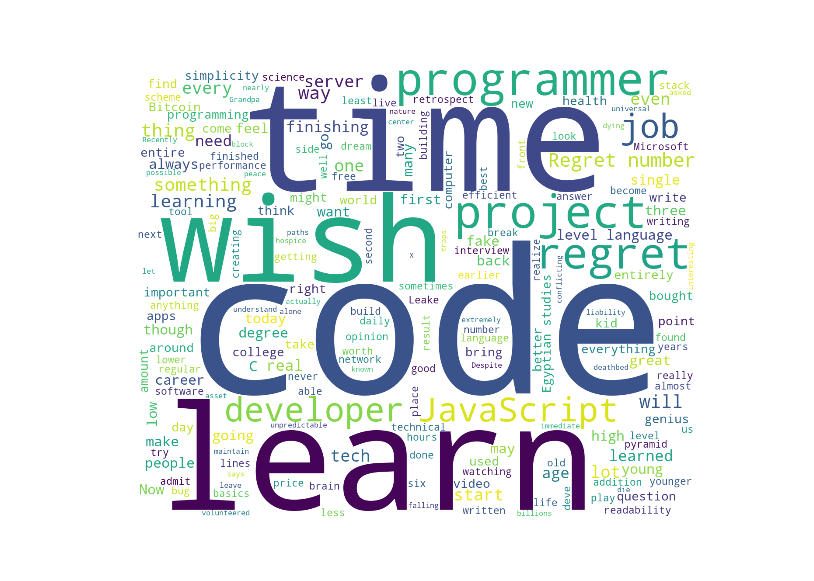

# yt-wordcloud

Final project for [CS50’s Introduction to Programming with Python](https://cs50.harvard.edu/python/2022/), by Guilherme Gabriel.

## 📌 Project Description



> Example generated from this video: [Fireship - 10 regrets of experienced programmers](https://www.youtube.com/watch?v=ehTIhQpj9ys)

**yt-wordcloud** is a Python application that:

1. Accepts a YouTube video URL from the user
2. Downloads the audio from the video in `.mp3` format
3. Transcribes the audio using OpenAI's Whisper model (running locally)
4. Generates a word cloud based on the transcribed text
5. Saves the generated word cloud image as `wordcloud.png`

This project showcases practical use of Python libraries such as `yt-dlp`, `whisper`, `matplotlib`, and `wordcloud`.

---

## ▶️ How to Run

### 1. Clone the repository

```bash
git clone https://github.com/Guilherme-27/yt-wordcloud.git
cd yt-wordcloud
```

### 2. Install dependencies

```bash
pip install -r requirements.txt
```

> ⚠️ You must also have `ffmpeg` installed on your system.
> Download it from [ffmpeg.org](https://ffmpeg.org/download.html) and ensure it's added to your system PATH.

### 3. Run the application

```bash
python project.py
```

* Enter a valid YouTube URL when prompted.
* The program will download the audio, transcribe it, and display a word cloud.
* The transcription will also be saved in `transcription.txt`.
* The word cloud image will be saved as `wordcloud.png`.

---

## 🧪 Running the Tests

This project includes unit tests using `pytest`.

To run the tests:

```bash
pytest
```

Included tests:

* `sanitize_filename()` — Ensures safe filenames are generated from video titles
* `generate_wordcloud()` — Confirms the word cloud is generated without errors
* `transcribe_audio()` — Transcribes a short audio file and checks the output

> Test audio: `audio/one_small_step.mp3`

---

## 📂 Project Structure

```
project.py            # Main application logic
test_project.py       # Unit tests
requirements.txt      # Python dependencies
transcription.txt     # Output of last transcription
wordcloud.png         # Output word cloud image
audio/                # Folder for saved audio files (e.g., one_small_step.mp3)
```

---

## 📽️ Video Demonstration

A short video (< 5 min) demonstrating the project and its features is included as part of the CS50P final submission.

---

## ✅ Notes

* Whisper model used: "tiny" (for speed on CPU)
* If running on a GPU with CUDA, the app will automatically use it
* You can change the model to "base" or "small" in `transcribe_audio()` for more accuracy
